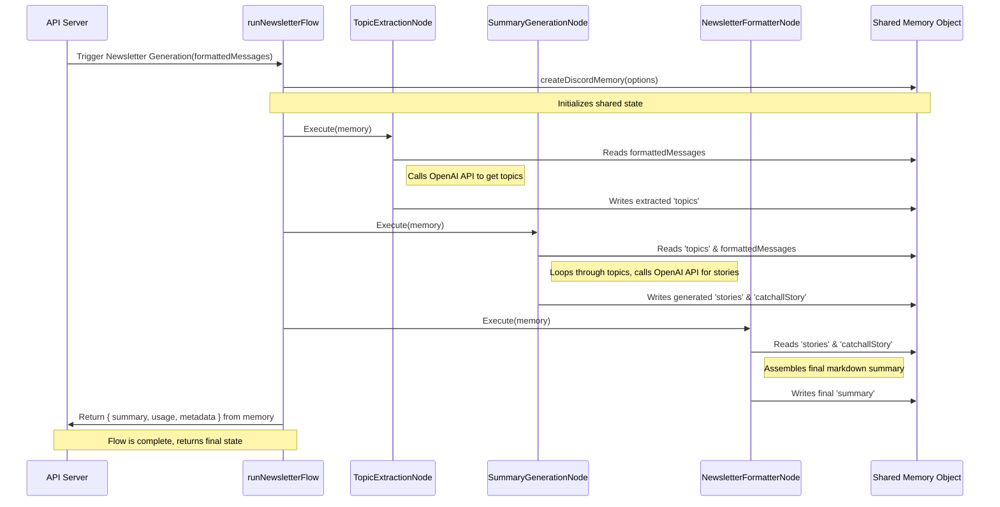

# Codebase Map: Discord Newsletter Service

This document provides a comprehensive, hierarchical map of the Discord Newsletter codebase, designed to rapidly onboard a new developer.

## 1. High-Level Architecture Overview

The application is a **Monolithic Node.js service with a lightweight vanilla JavaScript Single-Page Application (SPA)** for the frontend. Its primary purpose is to archive Discord messages, use an AI model (OpenAI) to generate summaries of channel activity, and send these summaries as email newsletters. A significant recent addition is the **BrainyFlow** engine, a modular system for creating AI processing pipelines, which is being gradually rolled out.

### Technology Stacks

*   **Backend**:
    *   **Framework**: Express.js
    *   **Database**: MongoDB with Mongoose ODM
    *   **AI/LLM**: `openai` Node.js library for direct calls and `openrouter-ai` for more advanced workflows.
    *   **Email**: `mailgun-js`
    *   **Testing**: Tape, Supertest

*   **Frontend**:
    *   **Framework**: None (Vanilla JS)
    *   **Templating**: `nanohtml`
    *   **Styling**: `tachyons`
    *   **Dev Server / Bundler**: `budo`

*   **AI Workflow Engine**:
    *   **BrainyFlow**: A custom, in-house framework (`lib/brainyflow`) for building modular, node-based AI processing pipelines. It orchestrates complex tasks like summarization and email generation through a series of discrete, reusable steps.

### Core Architectural Patterns

*   **Environment-Based Dependency Injection**: This is the most crucial architectural pattern for a new developer to understand. The codebase uses `process.env.NODE_ENV === 'test'` to conditionally require different module implementations. For services like the database (`lib/mongo`), Discord client (`lib/discord`), OpenAI client (`lib/openai`), and email client (`lib/email`), an `index.js` file acts as a switch, loading a real implementation for production and a mock version (e.g., `service-test.js`) for the test environment. This pattern allows for isolated and predictable unit/integration tests without actual network calls or database writes.

*   **Feature Flag for Phased Rollout**: The new **BrainyFlow** AI processing system is being introduced via a feature flag (`USE_BRAINYFLOW`). The `lib/brainyflow/monitoring.js` and `lib/brainyflow/brainyflow.js` files contain logic (`shouldUseBrainyFlow`) to decide whether to use the new pipeline or fall back to the legacy OpenAI implementation. This enables gradual rollout and A/B testing while migrating to a more sophisticated architecture.

*   **Pipeline Pattern (BrainyFlow)**: The BrainyFlow system implements the Pipeline design pattern. It decomposes the complex task of generating a newsletter into a sequence of independent, reusable components called "Nodes" (e.g., `MessageFetchNode`, `TopicExtractionNode`, `SummaryGenerationNode`, `NewsletterFormatterNode`). These nodes are chained together in `lib/brainyflow/flows.js` to create specific processing pipelines (`runNewsletterFlow`, `runEmailFlow`). This makes the AI logic more modular, testable, and easier to modify.

*   **Model-View-Controller (MVC) - Loosely Applied**:
    *   **Models**: `models/*.js` define the data schemas using Mongoose.
    *   **Views**: `client/*.js` files, using `nanohtml` for templating, are responsible for the presentation layer.
    *   **Controllers**: `api/*.js` files act as controllers, handling incoming HTTP requests, interacting with models, and sending responses.

## 2. Detailed Directory & File Analysis

This is a hierarchical breakdown of the repository's relevant files and directories.

-   **`/` (Root)**
    -   `server.js`: **[CRITICAL]** The main entry point of the application.
        -   **WHAT**: Initializes the Express server, sets up middleware (including a development proxy), mounts all API routes, and starts the server. It also handles graceful shutdown.
        -   **WHY**: This file orchestrates all backend components, acting as the central nervous system. It connects the API endpoints to the server, integrates the frontend dev server, and establishes top-level error handling.
        -   **Key Sections**:
            -   `setupDevServer()`: In development, starts a `budo` live-reloading server for the frontend and proxies requests to it. In production, this step is skipped, and Express serves static files from the `dist/` directory.
            -   `app.use(...)`: Mounts middleware (like `express.json()`) and all the API routers from the `api/` directory.
            -   **Health Check**: Sets up the `/health` endpoint using `healthpoint`, which includes a check for MongoDB connectivity.
            -   **Environment-specific Middleware**: Uses an `if (process.env.NODE_ENV === 'test')` block to apply mock authentication middleware for tests, a key pattern in this codebase.
            -   **Error Handling**: A final middleware function catches and formats all errors propagated through the application.
    -   `docker-compose.yml`: Defines the `mongodb` service for easy local development database setup.
    -   `.env.example`: A template for all required environment variables.
    -   `.env.test`: Environment variables specifically for the test suite.
    -   `README.md`: Project overview, setup, and usage instructions.
    -   `newspaper-workflow.js`: A script for running and testing the multi-step "newspaper" generation pipeline, which groups messages, writes stories, and assembles a final output. Great for debugging AI quality.
    -   `CLAUDE.md`: An important meta-document providing guidance for AI assistants on the project's architecture, key commands, and development patterns.

-   **`api/`**: Contains all API route handlers (the "controllers").
    -   `summarize.js`: **[CRITICAL]** Defines the endpoints for generating message summaries.
        -   **WHAT**: Handles `GET /summarize` to check for cached summaries and `POST /summarize` to trigger a new summary generation.
        -   **WHY**: This is the core endpoint for the application's main feature. It acts as the gateway to the AI summarization logic, determines whether to use a cached result, and orchestrates the call to the underlying AI service (`openai` or the `brainyflow` wrapper).
        -   **Key Functions**:
            -   `GET /`: Checks the `Summary` collection for a recently generated summary for a given channel/timespan. If none exists, it returns the total message count. This prevents redundant, expensive AI calls.
            -   `POST /`: Fetches messages from the DB, formats them, and calls `openai.summarizeMessages()` (which may delegate to BrainyFlow) to generate a new summary, which is then saved to the `Summary` collection.
    -   `email-summary.js`: Defines the API endpoint for triggering an email summary. It orchestrates fetching messages, generating a summary, and sending the email.
    -   `brainyflow-status.js`: Provides endpoints to monitor the health, metrics, and configuration of the BrainyFlow engine.
    -   `guilds.js`: API endpoints for fetching Discord guilds and their channels that the bot has access to.
    -   `messages.js`: API endpoints for querying stored Discord messages from MongoDB with filtering, pagination, and format options (`json` or `txt`).
    -   `preview.js`: API endpoint to fetch live, unstored messages directly from Discord for a channel preview.
    -   `settings.js`: CRUD endpoints for managing which Discord channels the service should actively monitor and collect messages from.

-   **`client/`**: Frontend single-page application code.
    -   `index.js`: The entry point for the frontend. It sets up a client-side router (`http-hash` style) to render different views.
    -   `channel-detail.js`: **[CRITICAL UI COMPONENT]** The most important UI view.
        -   **WHAT**: Renders the page for a specific channel. It displays stored messages, shows the latest summary, and contains UI logic to toggle message collection and trigger new summary generation via API calls.
        -   **WHY**: This is the primary user-facing interface for interacting with the service's core features for a given Discord channel.
    -   `guilds.js`, `channels.js`, `settings.js`, `welcome.js`: Other "views" or "pages" of the application, rendered using `nanohtml`.
    -   `state.js`: A simple event emitter for managing client-side state.
    -   `style/`: Contains CSS files (`tachyons.js`, `loaders.js`) injected into the client.

-   **`config/`**
    -   `index.js`: **[CRITICAL]** Centralized configuration loader.
        -   **WHAT**: Loads environment variables from `.env` using `dotenv`, provides sane default values, and exports a single, unified configuration object for the entire application.
        -   **WHY**: This file decouples configuration from application code, allowing behavior to be changed across different environments (dev, test, prod) without code modification. It is the single source of truth for all configurable settings.

-   **`docs/`**: Documentation and historical notes.
    -   `01...md` to `06...md`: A series of "how-to" guides documenting the step-by-step implementation of major features like summarization, email, and rating scripts. These are invaluable for understanding the project's evolution.
    -   `brainyflow-migration-plan.md`, `brainyflow.md`, `core_abstraction/`, `design_pattern/`, `guides/`: A comprehensive set of documents explaining the **BrainyFlow framework**, its concepts (Node, Flow, Memory), and how to use it. This indicates BrainyFlow is a very significant, well-documented component.

-   **`evaluation-history/` & `workflow-runs/`**: These directories contain artifacts from running and evaluating the newspaper/summary generation pipeline. This includes sample messages, prompts used, raw AI output, and final reports. They are invaluable for understanding and debugging the AI's behavior and quality.

-   **`lib/`**: Core application logic and wrappers around external services.
    -   **`brainyflow/`**: **[SUBSYSTEM]** A modular AI workflow engine. This is a core component representing a shift away from simple, direct OpenAI calls to a more structured pipeline.
        -   `index.js`: Environment-aware switch for BrainyFlow. Uses `process.env.NODE_ENV` to load `brainyflow-test.js` during tests.
        -   `brainyflow.js`: **[CRITICAL]** The production orchestrator. It wraps flow executions, records metrics via `monitoring.js`, and handles the feature flag logic (`shouldUseBrainyFlow`) to decide whether to use BrainyFlow or the legacy `openai.js` implementation.
        -   `flows.js`: **[CRITICAL]** Defines the application's core AI pipelines. It composes different `Nodes` into sequential workflows like `runSimpleFlow`, `runNewsletterFlow`, and `runEmailFlow`. This is where the main "business logic" of the AI processing resides.
        -   `nodes/`: A directory of individual, single-responsibility processing units for the BrainyFlow pipelines.
            -   `MessageFetchNode.js`: Fetches messages from MongoDB.
            -   `TopicExtractionNode.js`: Uses an LLM to identify conversation topics.
            -   `SummaryGenerationNode.js`: Generates stories for each topic and a catch-all for remaining content.
            -   `NewsletterFormatterNode.js`, `EmailFormatterNode.js`, `TextFormatterNode.js`: Format the output for different delivery channels.
            -   `EmailDeliveryNode.js`: Sends the final email via Mailgun.
        -   `monitoring.js`: Collects and exposes metrics for BrainyFlow executions (used by `api/brainyflow-status.js`).
        -   `utils.js`: Helper functions specific to the BrainyFlow implementation, such as date calculations and URL deduplication.
    -   `discord/`: Wrapper for the Discord client, following the environment-switching pattern.
    -   `email/`: Wrapper for the Mailgun email client, following the environment-switching pattern.
    -   `mongo/`: Wrapper for the Mongoose DB connection, following the environment-switching pattern (using `mongodb-memory-server` for tests).
    -   `openai/`: The legacy AI summarization service.
        -   `openai.js`: Production implementation making multi-pass calls to the OpenAI API for "newspaper-style" summarization.
        -   `openai-test.js`: Mock implementation for tests.
        -   `newspaper-prompts.js`: Stores the large, multi-step prompts used for generating the newspaper-style summaries. These are critical to the AI's output quality.
    -   `auto-catch.js`: A utility to wrap async Express route handlers to automatically catch and forward errors.
    -   `message-formatter.js`: Centralized module for formatting arrays of messages into a readable plain text format.
    -   `message-formatter-llm.js`: An enhanced message formatter that flattens reply chains for better processing by LLMs.

-   **`middleware/`**: Express middleware functions.
    -   `auth.js` / `auth-test.js`: Authentication logic. The `index.js` file uses the environment-switching pattern to apply real auth in production and mock auth during tests.

-   **`models/`**: Mongoose schemas defining the structure of data in MongoDB.
    -   `message.js`: Schema for a stored Discord message, including comprehensive metadata like content, author, attachments, and reply/thread info.
    -   `settings.js`: Schema for channels that are actively being collected.
    -   `summary.js`: Schema for a generated summary, used to cache the result along with usage stats and metadata.

-   **`scripts/`**: Standalone scripts for various administrative and diagnostic tasks.
    -   `archive-messages.js`: Manually archives messages for a specific channel and date range.
    -   `backfill-rich-messages.js`: A newer script to populate the `rich_messages` collection, which contains more detailed Discord data than the original `messages` collection.
    -   `conversation-map-3days.js`, `message-map-3days.js`: Diagnostic scripts to analyze and display conversation threads from recent history.
    -   `rate-summary.js`: A script to collect and rate the quality of generated summaries, used for evaluation and prompt engineering.
    -   `send-daily-summary.js`: An example script to trigger the daily summary email, intended to be run by a cron job.

-   **`story-optimizer/`**: A separate Python-based project using the `dspy-ai` library to evaluate and programmatically optimize the prompts used for story generation. This is an advanced R&D component for improving AI output quality.

-   **`test/`**: Contains all automated tests for the application.
    -   `index.js`: The main test runner that finds and executes all `*.test.js` files.
    -   `api/`, `brainyflow/`, `discord/`, `models/`: Subdirectories with tests for their corresponding application parts.
    -   `helpers/`: Test helpers, including `mock-auth.js` and `cleanup.js`.

## 3. Key Data Flow Analysis

The primary user story is **Generating and emailing a daily channel summary**. This flow demonstrates the full pipeline from data fetching to AI processing and final delivery, using the modern BrainyFlow architecture.

Here is a step-by-step, end-to-end trace of this flow:

1.  **Trigger**: An external process (like a cron job running `scripts/send-daily-summary.js`) makes a `POST` request to the `/email-summary/channel/:channelId` endpoint with a payload like `{ "to": "recipient@example.com", "since": "24h" }`. The code shows a migration towards this flow being orchestrated by `runEmailFlow` inside the BrainyFlow system. We will trace this modern path.

2.  **Flow Initialization (`lib/brainyflow/flows.js`)**: A call is made to the `runEmailFlow` function.
    -   It creates a `memory` object using `createDiscordMemory` to hold state throughout the flow. This `memory` object is the "state bus" for the entire pipeline.
    -   It then executes a sequence of nodes, passing the `memory` object to each.

3.  **`MessageFetchNode.js` (`nodes/MessageFetchNode.js`)**:
    -   **prep**: Reads `guildId`, `channelId`, and `since` from `memory`. It uses `calculateDateRange` to determine the start and end dates.
    -   **exec**: Queries the MongoDB `messages` collection via Mongoose (e.g., `Message.find(...)`) for all messages within the calculated date range.
    -   **post**: Stores the fetched array of `messages` in `memory`. It then calls `formatMessagesForAI` to create a single `formattedMessages` string and stores that in `memory` as well.

4.  **`TopicExtractionNode.js` (`nodes/TopicExtractionNode.js`)**:
    -   **prep**: Reads `formattedMessages` from `memory`.
    -   **exec**: Sends the `formattedMessages` to the OpenAI API with a prompt to extract key conversation topics.
    -   **post**: Parses the JSON response from OpenAI and stores the list of `topics` in `memory`. It includes logic to handle and fix malformed JSON from the LLM.

5.  **`SummaryGenerationNode.js` (`nodes/SummaryGenerationNode.js`)**:
    -   **prep**: Reads the `topics` and `formattedMessages` from `memory`.
    -   **exec**: For each *substantial* topic, it sends a request to the OpenAI API with a specific prompt to write a news story. It then generates a "catch-all" community highlights story for any remaining content.
    -   **post**: Stores the generated `stories` and `catchallStory` into `memory`. It also aggregates all token `usage` data from the API calls.

6.  **`EmailFormatterNode.js` (`nodes/EmailFormatterNode.js`)**:
    -   **prep**: Reads the `summary` (assembled by the previous node), `startDate`, `endDate`, and `emailOptions` from `memory`.
    -   **exec**: Generates an `emailSubject`. It also uses the `marked` library to convert the markdown summary into an HTML email body (`emailHtmlContent`) and creates a plain text version (`emailTextContent`).
    -   **post**: Stores the `emailSubject`, `emailHtmlContent`, `emailTextContent`, and the recipient `emailTo` address in `memory`.

7.  **`EmailDeliveryNode.js` (`nodes/EmailDeliveryNode.js`)**:
    -   **prep**: Reads `emailSubject`, `emailHtmlContent`, `emailTo`, etc., from `memory`.
    -   **exec**: Uses the `email.sendEmail` function (which wraps the Mailgun API client in `lib/email/email.js`) to send the formatted email.
    -   **post**: Stores the `emailId` from Mailgun's response into `memory` and sets a `{ metadata: { emailDelivered: true } }` flag.

8.  **Flow Completion**: The `runEmailFlow` function completes. It returns a success object containing the `emailId` and other relevant data pulled from the final state of the `memory` object.

## 4. Configuration and Environment Analysis

The application is configured via environment variables, loaded by `dotenv` from an `.env` file and processed in **`config/index.js`**. This file provides defaults, and is the single source of truth for all configuration.

The `NODE_ENV` variable is critical. When set to `test`, it triggers the dependency injection pattern to load mock services for Discord, MongoDB, OpenAI, and Email, enabling isolated testing.

### Configuration Variable Cross-Reference

| Config Key | Example Value / Source | Consumed In | Purpose |
| :--- | :--- | :--- | :--- |
| `PORT` | `3000` (default) | `server.js` | The port the Express web server listens on. |
| `MONGO_URI` | `mongodb://localhost:27017/` | `config/index.js`, `lib/mongo/mongo.js` | The connection string for the MongoDB database. |
| `MONGO_DB_NAME` | `discord-newsletter` (default) | `config/index.js`, `lib/mongo/mongo.js` | The name of the database to use within MongoDB. |
| `NODE_ENV` | `test`, `development`, `production` | **Multiple files** (`server.js`, `lib/*/index.js`) | **Critical**. Switches between production and test configurations, especially for loading mock services. |
| `OPENAI_API_KEY` | `sk-xxxxxxxxxx` | `config/index.js`, `lib/openai/openai.js` | **Required for Prod/Dev**. API key for accessing the OpenAI service. |
| `OPENAI_MODEL` | `gpt-4o-mini` (default) | `config/index.js`, `lib/openai/openai.js` | The default OpenAI model to use for summarization. |
| `MAILGUN_API_KEY`| `key-xxxxxxxxxx` | `config/index.js`, `lib/email/email.js` | **Required for Prod/Dev**. API key for the Mailgun email service. |
| `MAILGUN_DOMAIN` | `mg.example.com` | `config/index.js`, `lib/email/email.js` | **Required for Prod/Dev**. The domain registered with Mailgun for sending emails. |
| `USE_BRAINYFLOW` | `true` or `false` (default) | `config/index.js`, `lib/brainyflow/brainyflow.js` | A feature flag to enable the modular BrainyFlow AI pipeline instead of the legacy `openai.js` service. |
| `AUTHENTIC_SERVER` | `https://auth.example.com` | `config/index.js`, `middleware/auth.js` | URL for the authentication service used in production. |
| `WHITELIST` | `a@b.com,c@d.com` (default empty)| `config/index.js`, `middleware/auth.js` | A comma-separated list of email addresses authorized to use the service in production. |

## 5. Architectural Visualization

The most complex and non-obvious interaction in the codebase is the **BrainyFlow Newsletter Generation Pipeline**. While the code in `lib/brainyflow/flows.js` shows a sequential execution, a diagram helps visualize how the `memory` object acts as a shared state bus between independent, modular nodes. This decouples the nodes from each other, as they only need to know about the `memory` object's schema.

This sequence diagram illustrates the `runNewsletterFlow` process.

